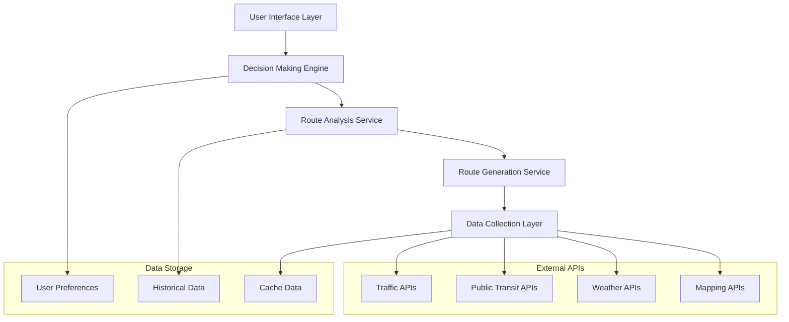

# Design Document: Daily Commute Optimizer

## Overview

The Daily Commute Optimizer is a decision-support application that empowers users to make informed commute choices by presenting multiple route options with transparent trade-off analysis. Rather than prescribing a single "optimal" route, the system provides comprehensive comparisons across time, cost, stress, and reliability factors, allowing users to select routes that align with their daily priorities and circumstances.

The system architecture emphasizes transparency, user agency, and contextual decision-making, moving away from black-box optimization toward explainable route comparison and recommendation.

## Architecture

The system follows a modular architecture with clear separation between data collection, analysis, presentation, and user interaction layers:



### Core Components

1. **Route Generation Service**: Discovers multiple viable routes using different paths, transportation modes, and departure times
2. **Route Analysis Service**: Evaluates routes across multiple criteria and calculates trade-offs
3. **Decision Making Engine**: Applies user preferences and provides contextual recommendations with explanations
4. **Data Collection Layer**: Aggregates real-time data from traffic, transit, weather, and mapping services
5. **User Interface Layer**: Presents route comparisons and facilitates preference management

## Components and Interfaces

### Route Generation Service

**Purpose**: Generate 2-3 diverse, viable route options for each commute request

**Key Methods**:
- `generateRoutes(origin, destination, departureTime, constraints)`: Returns multiple route alternatives
- `diversifyRoutes(baseRoutes)`: Ensures route diversity across path, mode, and timing
- `validateRouteViability(route)`: Confirms route is realistic and achievable

**Route Diversity Strategy**:
- **Path Diversity**: Different geographical routes (highway vs surface streets)
- **Mode Diversity**: Different transportation methods (driving, transit, cycling, walking, multi-modal)
- **Timing Diversity**: Different departure times within reasonable bounds

### Route Analysis Service

**Purpose**: Evaluate each route across the four core criteria: time, cost, stress, and reliability

**Key Methods**:
- `analyzeRoute(route, currentConditions)`: Returns comprehensive route analysis
- `calculateTravelTime(route, trafficData, transitData)`: Estimates total travel time
- `calculateCost(route, fuelPrices, transitFares, parkingCosts)`: Computes total monetary cost
- `calculateStressLevel(route, trafficConditions, weatherData)`: Estimates commute stress
- `calculateReliability(route, historicalData, currentConditions)`: Predicts route consistency

**Stress Level Calculation**:
Based on research showing that commute stress correlates with:
- Traffic congestion levels and stop-and-go patterns
- Route predictability and variability
- Weather conditions and visibility
- Number of transfers or mode changes
- Parking availability and walking distances

**Reliability Calculation**:
- Historical variance in travel times for similar conditions
- Real-time incident probability on route segments
- Weather impact on different transportation modes
- Service reliability for public transit components

### Decision Making Engine

**Purpose**: Apply user preferences to route analysis and provide transparent recommendations

**Key Methods**:
- `rankRoutes(routes, userPreferences)`: Orders routes based on weighted criteria
- `generateRecommendation(rankedRoutes, context)`: Creates contextual recommendation with reasoning
- `explainTradeoffs(routes)`: Generates clear trade-off explanations
- `identifyWhenNotToChoose(route)`: Creates "when NOT to choose" guidance

**Preference Weighting System**:
- Time Priority: 0-100% weight on minimizing travel time
- Cost Priority: 0-100% weight on minimizing monetary cost  
- Comfort Priority: 0-100% weight on minimizing stress/effort
- Reliability Priority: 0-100% weight on maximizing predictability
- Weights must sum to 100% and update rankings dynamically

### Data Collection Layer

**Purpose**: Aggregate real-time data from external sources and maintain data freshness

**Key Integrations**:
- **Traffic APIs**: Google Maps Traffic, HERE Traffic, Waze
- **Public Transit APIs**: GTFS feeds, local transit authority APIs
- **Weather APIs**: Current conditions and short-term forecasts
- **Mapping APIs**: Route geometry, points of interest, parking data

**Data Refresh Strategy**:
- Traffic data: Every 2-3 minutes during active use
- Transit data: Every 5 minutes or on schedule updates
- Weather data: Every 15 minutes
- Static data (maps, POIs): Daily or on-demand

## Data Models

### Route Model
```typescript
interface Route {
  id: string;
  segments: RouteSegment[];
  totalDistance: number;
  estimatedTime: number;
  estimatedCost: number;
  stressLevel: number; // 1-10 scale
  reliabilityScore: number; // 1-10 scale
  transportationModes: TransportationMode[];
  departureTime: Date;
  arrivalTime: Date;
  instructions: string[];
}

interface RouteSegment {
  mode: TransportationMode;
  startLocation: Location;
  endLocation: Location;
  distance: number;
  duration: number;
  instructions: string;
  realTimeData?: RealTimeSegmentData;
}
```

### User Preferences Model
```typescript
interface UserPreferences {
  userId: string;
  preferenceProfiles: PreferenceProfile[];
  savedLocations: SavedLocation[];
  notificationSettings: NotificationSettings;
  defaultProfile: string;
}

interface PreferenceProfile {
  name: string;
  timeWeight: number; // 0-100
  costWeight: number; // 0-100
  comfortWeight: number; // 0-100
  reliabilityWeight: number; // 0-100
  maxWalkingDistance: number;
  preferredModes: TransportationMode[];
  avoidedFeatures: string[]; // highways, tolls, etc.
}
```

### Route Analysis Model
```typescript
interface RouteAnalysis {
  routeId: string;
  timestamp: Date;
  timeAnalysis: TimeAnalysis;
  costAnalysis: CostAnalysis;
  stressAnalysis: StressAnalysis;
  reliabilityAnalysis: ReliabilityAnalysis;
  tradeoffSummary: TradeoffSummary;
}

interface TradeoffSummary {
  strengths: string[];
  weaknesses: string[];
  whenToChoose: string[];
  whenNotToChoose: string[];
  comparedToAlternatives: ComparisonPoint[];
}
```

## Correctness Properties

*A property is a characteristic or behavior that should hold true across all valid executions of a system—essentially, a formal statement about what the system should do. Properties serve as the bridge between human-readable specifications and machine-verifiable correctness guarantees.*

After analyzing the acceptance criteria, I've identified several properties that can be combined for more comprehensive testing:

**Property Reflection**: Several properties can be consolidated:
- Route generation properties (1.1, 1.2, 1.3) can be combined into comprehensive route generation validation
- Route analysis properties (2.1, 2.4) can be combined into complete analysis validation  
- Preference properties (3.1, 3.3, 3.4) can be combined into preference management validation
- Transparency properties (4.1, 4.2, 5.1, 5.3) can be combined into comprehensive transparency validation

### Property 1: Route Generation Completeness
*For any* valid origin-destination pair, the system should generate 2-3 diverse routes that vary by path, transport mode, or departure time, and all generated routes should be viable connections between the specified locations.
**Validates: Requirements 1.1, 1.2, 1.3**

### Property 2: Forbidden Language Avoidance  
*For any* route presentation, the system should not use prescriptive terms like "best", "optimal", or "recommended" without clear explanation of the criteria used.
**Validates: Requirements 1.5, 4.4**

### Property 3: Complete Route Analysis
*For any* generated route, the system should evaluate it on all four criteria (travel time, cost, stress level, and reliability) using consistent metrics and units across all route comparisons.
**Validates: Requirements 2.1, 2.4**

### Property 4: Trade-off Comparison Completeness
*For any* set of routes displayed together, the system should show them in side-by-side comparison format and clearly indicate which factors improve and which worsen for each route option.
**Validates: Requirements 2.2, 2.3**

### Property 5: Preference Management Persistence
*For any* user preference adjustments (weights, profiles, settings), the system should accept the changes, store them persistently, and allow creation of multiple preference profiles that survive application restarts.
**Validates: Requirements 3.1, 3.3, 3.4**

### Property 6: Dynamic Preference Response
*For any* change in user preferences, the system should update route rankings dynamically and clearly show how the preference changes affect the rankings.
**Validates: Requirements 3.2, 3.5**

### Property 7: Contextual Recommendation Updates
*For any* significant change in weather, traffic, or transit conditions, the system should update recommendations and consider these current conditions in the recommendation logic.
**Validates: Requirements 4.3, 4.5**

### Property 8: Comprehensive Transparency
*For any* route or recommendation, the system should include reasoning for selection, identify situations where it may perform poorly, include "When NOT to choose this" explanations, highlight potential drawbacks, and ensure all decision factors are visible.
**Validates: Requirements 4.1, 4.2, 5.1, 5.3**

### Property 9: Alternative Context Provision
*For any* route option, the system should provide context about when alternative routes might be preferable, helping users understand the full decision landscape.
**Validates: Requirements 5.4, 5.5**

Now I need to analyze the acceptance criteria to determine which can be tested as properties:

<function_calls>
<invoke name="prework">
<parameter name="featureName">daily-commute-optimizer

## Error Handling

The system must gracefully handle various error conditions while maintaining transparency about limitations:

### Data Availability Errors
- **Insufficient Routes**: When fewer than 2 routes are available, clearly explain the limitation and provide the available route(s) with full analysis
- **API Failures**: When external data sources are unavailable, use cached data with clear timestamps and uncertainty indicators
- **Network Connectivity**: Provide offline mode with historical data and clear indicators of data freshness

### Invalid Input Handling
- **Invalid Locations**: Provide clear feedback for unrecognizable addresses with suggested corrections
- **Impossible Routes**: Explain when no viable routes exist (e.g., disconnected locations, time constraints)
- **Invalid Preferences**: Validate preference weights sum to 100% and provide helpful error messages

### Real-Time Data Issues
- **Stale Data**: Clearly indicate when real-time data is outdated and may affect accuracy
- **Conflicting Data**: When different APIs provide conflicting information, present uncertainty ranges
- **Service Disruptions**: Proactively notify users when transit services or major routes are disrupted

### Performance Degradation
- **Slow Response Times**: Provide progress indicators and allow users to proceed with partial results
- **High Load**: Implement graceful degradation by reducing route diversity or analysis depth when necessary
- **Resource Constraints**: Prioritize core functionality (route generation) over advanced features (detailed analytics)

## Testing Strategy

The testing approach combines unit tests for specific scenarios with property-based tests for comprehensive validation across all inputs.

### Property-Based Testing Framework
- **Framework**: Use Hypothesis (Python) or fast-check (TypeScript) for property-based testing
- **Test Configuration**: Minimum 100 iterations per property test to ensure comprehensive input coverage
- **Generator Strategy**: Create smart generators that produce realistic commute scenarios, valid preference combinations, and diverse route conditions

### Unit Testing Focus
Unit tests should concentrate on:
- **Specific Examples**: Test known good/bad cases that demonstrate correct behavior
- **Edge Cases**: Handle boundary conditions like single-route scenarios, extreme preferences, or data unavailability
- **Integration Points**: Verify correct interaction between components, especially data flow and API integration
- **Error Conditions**: Validate proper error handling and user feedback

### Property Test Implementation
Each correctness property will be implemented as a property-based test:

**Property 1 Test**: Generate random origin-destination pairs and verify 2-3 diverse, viable routes
- **Tag**: Feature: daily-commute-optimizer, Property 1: Route Generation Completeness
- **Generator**: Valid geographic coordinates, realistic time constraints
- **Validation**: Route count, diversity metrics, viability checks

**Property 2 Test**: Generate random route presentations and verify no forbidden language without explanation
- **Tag**: Feature: daily-commute-optimizer, Property 2: Forbidden Language Avoidance  
- **Generator**: Various route descriptions and recommendation text
- **Validation**: Text analysis for forbidden terms, explanation presence

**Property 3 Test**: Generate random routes and verify complete analysis with consistent metrics
- **Tag**: Feature: daily-commute-optimizer, Property 3: Complete Route Analysis
- **Generator**: Diverse route configurations and conditions
- **Validation**: All four criteria present, metric consistency

**Property 4 Test**: Generate random route sets and verify complete comparison presentation
- **Tag**: Feature: daily-commute-optimizer, Property 4: Trade-off Comparison Completeness
- **Generator**: Multiple route combinations
- **Validation**: Side-by-side format, improvement/degradation indicators

**Property 5 Test**: Generate random preference changes and verify persistence
- **Tag**: Feature: daily-commute-optimizer, Property 5: Preference Management Persistence
- **Generator**: Valid preference weights and profile configurations
- **Validation**: Storage, retrieval, profile management

**Property 6 Test**: Generate random preference changes and verify dynamic ranking updates
- **Tag**: Feature: daily-commute-optimizer, Property 6: Dynamic Preference Response
- **Generator**: Preference modifications and route sets
- **Validation**: Ranking changes, explanation updates

**Property 7 Test**: Generate random condition changes and verify recommendation updates
- **Tag**: Feature: daily-commute-optimizer, Property 7: Contextual Recommendation Updates
- **Generator**: Weather, traffic, and transit condition variations
- **Validation**: Recommendation changes, condition consideration

**Property 8 Test**: Generate random routes and verify comprehensive transparency
- **Tag**: Feature: daily-commute-optimizer, Property 8: Comprehensive Transparency
- **Generator**: Various route and recommendation scenarios
- **Validation**: Reasoning presence, caveat identification, transparency completeness

**Property 9 Test**: Generate random route options and verify alternative context provision
- **Tag**: Feature: daily-commute-optimizer, Property 9: Alternative Context Provision
- **Generator**: Route sets with varying characteristics
- **Validation**: Alternative guidance, context completeness

### Testing Balance
- **Property Tests**: Handle comprehensive input coverage and universal correctness validation
- **Unit Tests**: Focus on specific examples, integration points, and error conditions
- **Integration Tests**: Verify end-to-end flows and external API interactions
- **User Acceptance Tests**: Validate decision-support effectiveness and user experience

The dual approach ensures both broad correctness (property tests) and specific scenario validation (unit tests), providing confidence in the system's reliability and user value.